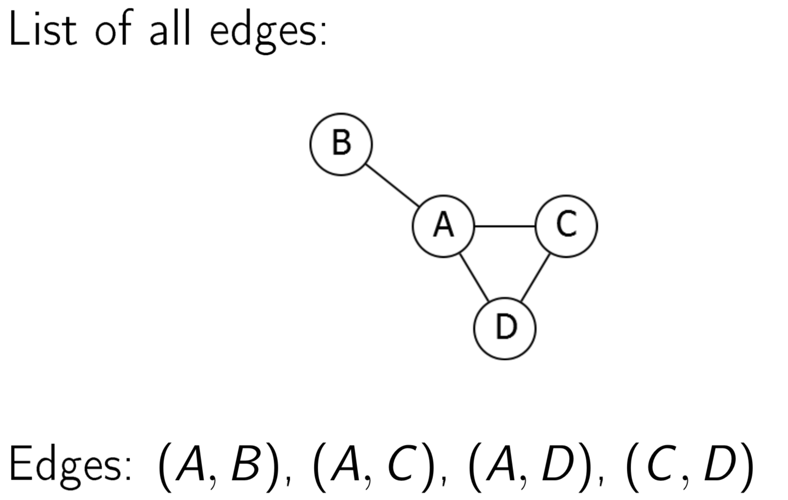
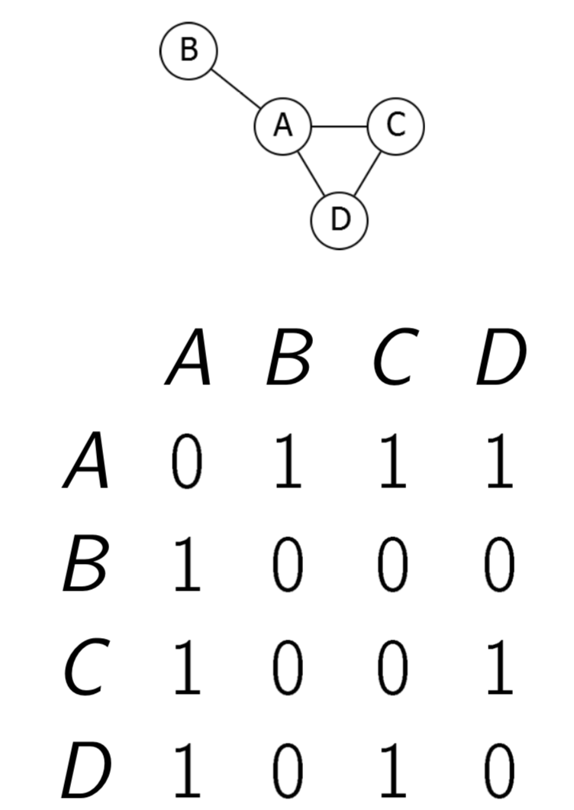
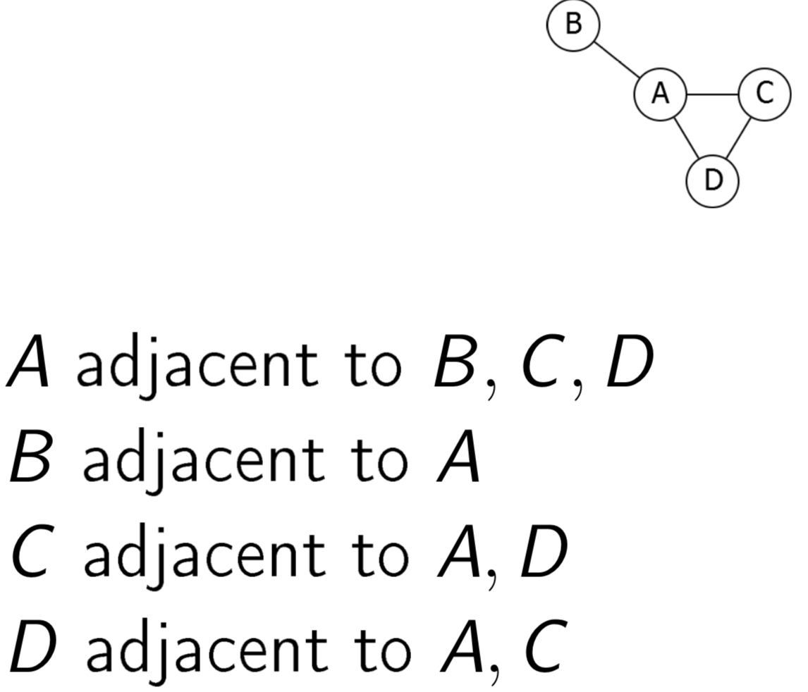

provide ways in which a graph can be represented on a computer.

Graph consist of:
-   Vertices (or nodes).
-   Edges connecting pairs of vertices.

There are several ways to represent these nodes and vertices.

List of edges (vertices)

It is symmetric for undirected graph, unsysmmetric for directed graph.

For each node, you have list of following node that connected to it
