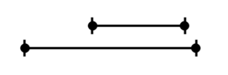
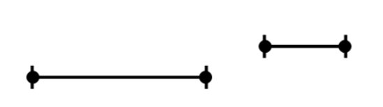
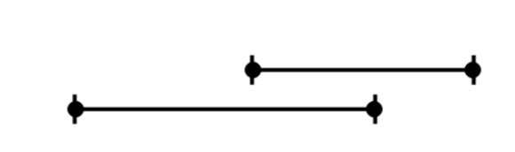

**Normal** DFS just marks all vertices as visited.

We also want to keep track of other data to be useful. So we add augment functions to store additional information.

We introduct the concept of previsit and postvisit
```Python
Explore(node):
visited(node) ← true 
previsit(node)
for subnode the connected to node:
    if not visited(subnode): 
        explore(subnode)
postvisit(node)
```
The postvisit&previsit function are basically implemented by the Clock

That is we create a clock during the whole travesal, every time we start visit a new node ( go into previsit) and finish the visit of the node( go into postvisit)

We give the current clock value to the previsit and postvisit array in the given node position.

So after we travese every node have it's previsit and postvisit value
Pseudoode of previsit and postvisit
```Python
global clock = 0
def previsit(node):
    pre[node] = clock 
    clock = clock + 1
def postvisit(node):
    pre[node] = clock 
    clock = clock + 1
```

Previsit and Postvisit numbers tell us about the execution information of DFS.
And there is a **lemma** for this!

For any vertices \(u\), \(v\) the intervals \([pre[u],post[u]]\) and \([pre[v],post[v]]\) are either nested or disjoint and it can not be Interleaved
Nested:


Disjointed


Interleaved(which is not possible)


The thought of why interleaved is not possible is that:
You either go from $u$ (suppose it's previous node) to $v$ (suppose it's latter node). 

In this way, it's must be nest relation of two node's previsit and postvisit interval.

If you go to $u$, $v$ independently, it have been the relation of disjointed.

It doesn't exist a third **Visiting** relation 
