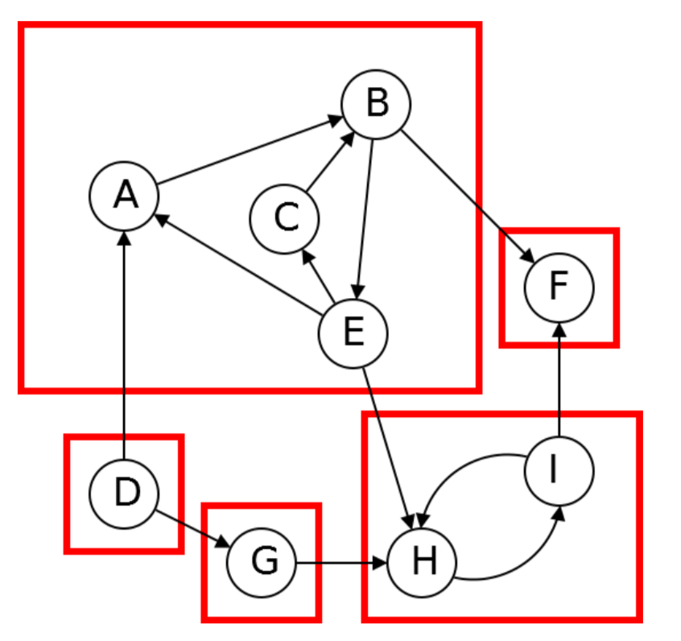
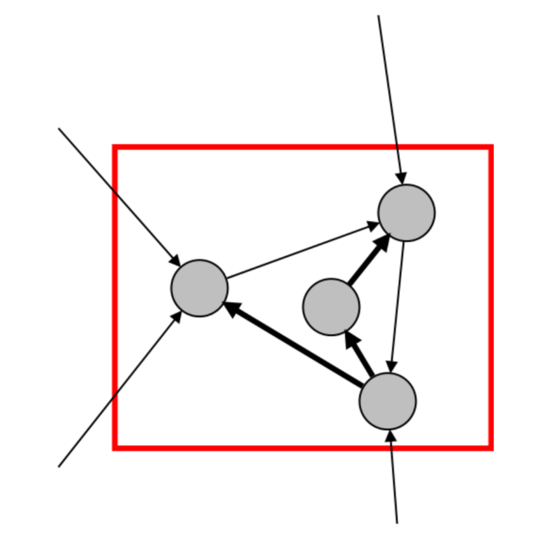
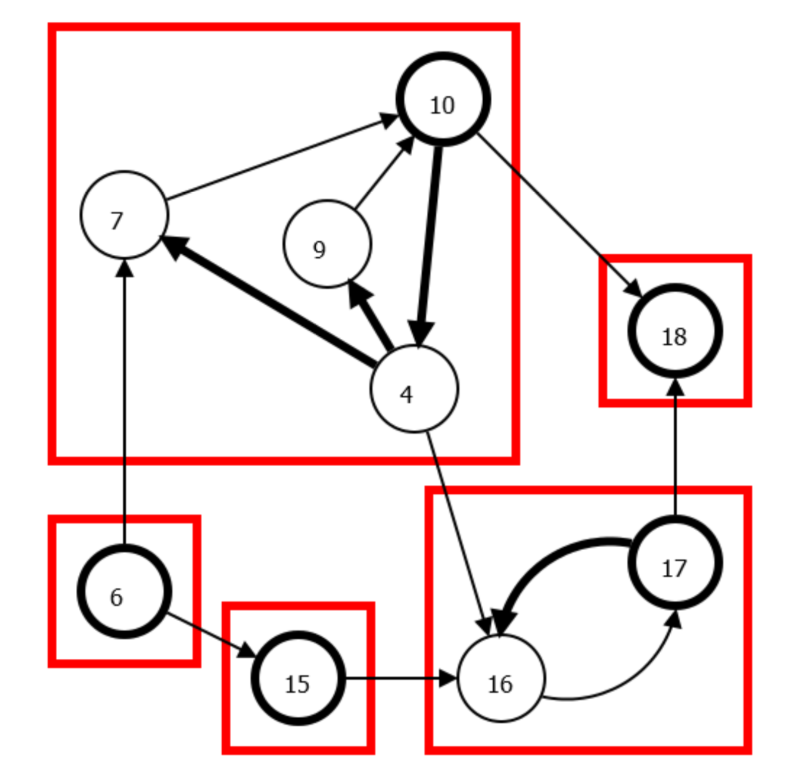

###Strongly Connected Components
####Definition
Two vertices **v**,**w** in a directed graph are connected if you can reach **v** from **w** and can reach **w** from **v**.
####As a result
A directed graph can be partitioned into **strongly connected components** where two vertices are connected if and only if they are in the same component.

The SCCs in the graph compose a meta graph

For how to find all the strongly connected components in a graph.

We consider that if the strongly connected component in meta graph is a sink SCC (which all the connections are pointed to it).
We can run topological sort step by step to List the DAG in meta-graph.

Consider if we try to label the previst and postvisit number of each nodes in the graph. The node with highest postvisit is very like to be a source node in the graph.

So, we can to find the source SCC in **Reverse** graph of the origin graph and in this way we find each sink SCC of origin graph which is convenient for topological sort.

The Basic idea is:
-   run DFS(Reversed Graph)
-   look at Node v in reversed graph with largest [postvisit](previsit-and-postvisit-orders.md) number
-   Explore node V in **ORIGIN** graph
-   Every node that achievable from V is part of the sink SCC
-   Remove the Sink SCC and repeat

Improve version is implement visited label for each node and only visit the unvisited ones
-   run DFS(Reversed Graph)
-   look at Node v in reversed graph with largest postvisit number
-   Explore node V in **ORIGIN** graph
-   Every node that achievable from V is part of the sink SCC and label all the visited node
-   repeat