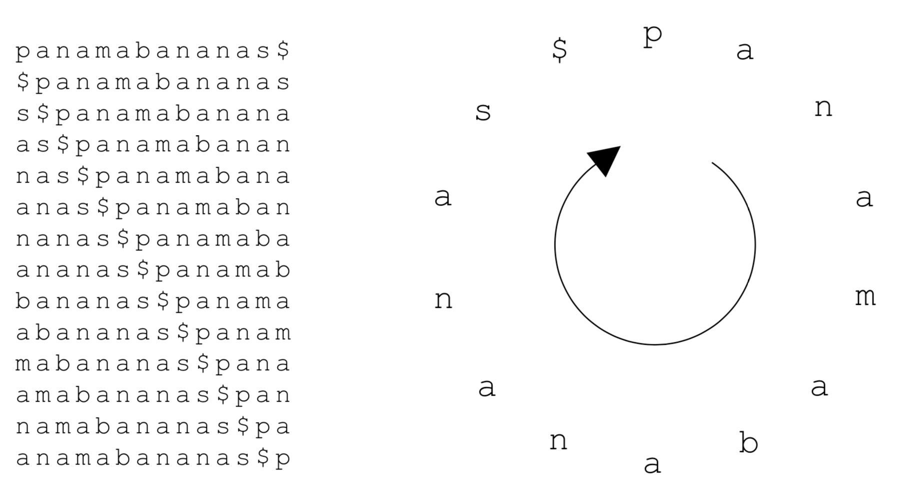
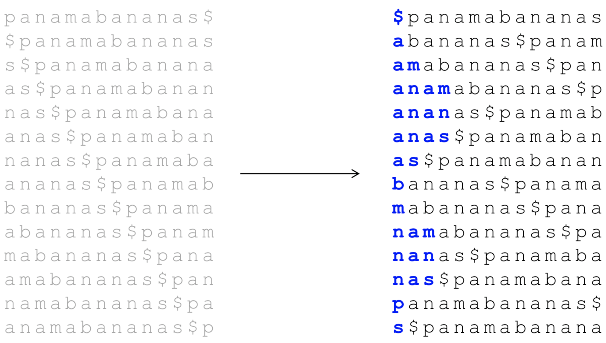
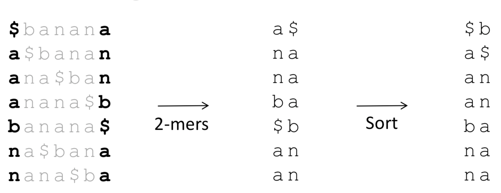
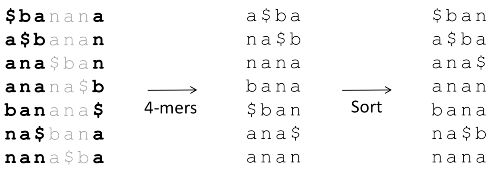
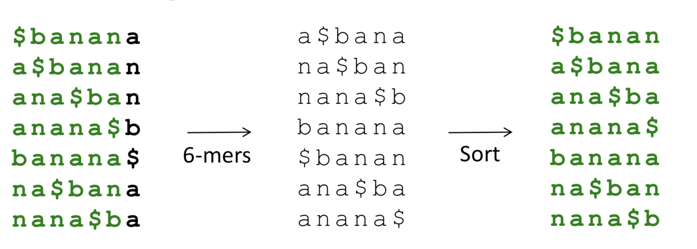
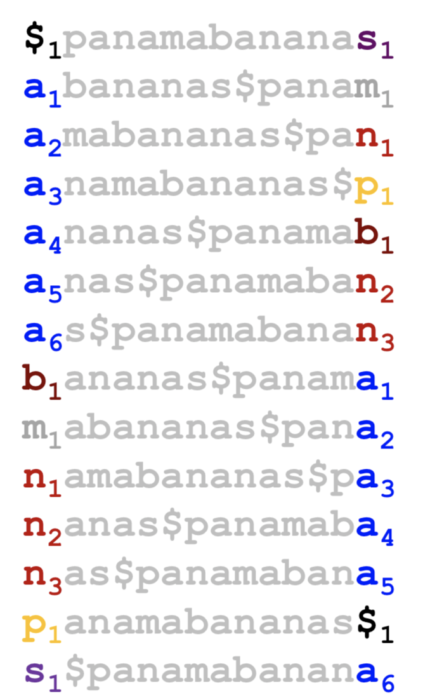

Cyclic Rotations

After the cyclic rotations, sort the result lexicographically(**$** comes first)

we take the last column as BWT transform result.

So, $BWT(pananmabananas\$ = smnpbnnaaaaa\$a)$ 
Now, let's try to go back from $BWT()$ to original text.
Take $\$banana$ for example, 

we sort the result BWT transform result to get the first column, and concatenate the result together.

we repeat the step, at each time step, append the $result_{BWT}$ to the front of current result and make a resort

We have some observations
-   Reconstructing Text from BWT(Text) required us to store |Text| cyclic rotations of |Text| 
-   Can we invert BWT(Text) with less space and without |Text| rounds of sorting?

And, there is one interesting property

Given the $BWT$ transform result, and the result sorted lexicographically.
The k-th occurrence of symbol in FirstColumn and the k-th occurrence of symbol in LastColumn correspond to appearance of symbol at the same position in Text.

So, can we use $BWT$ to design a more memory efficient linear-time algorithm for Multiple Pattern Matching.