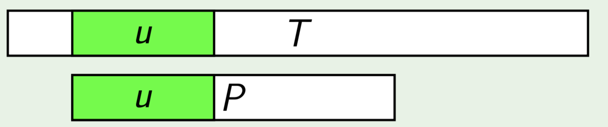
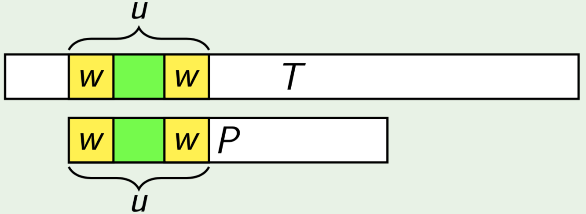
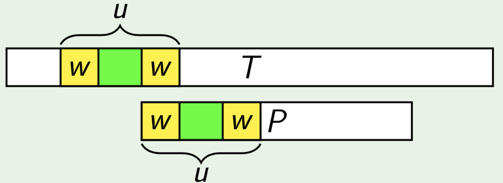
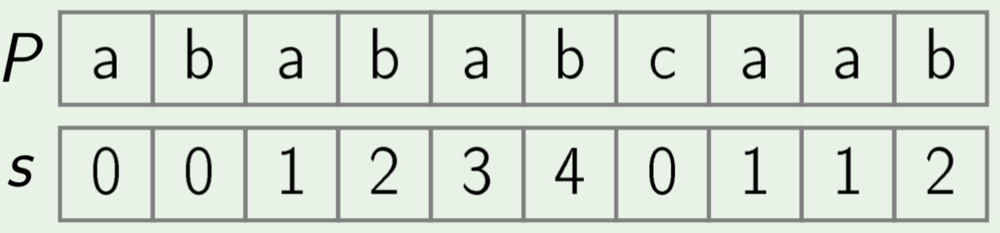
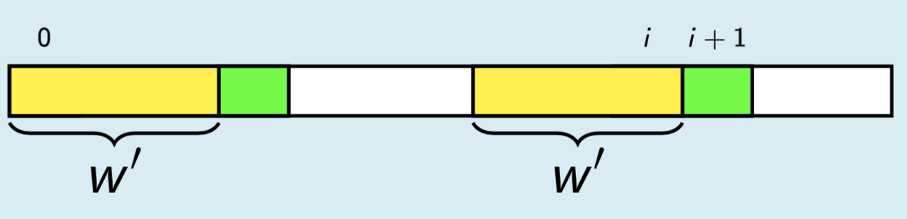
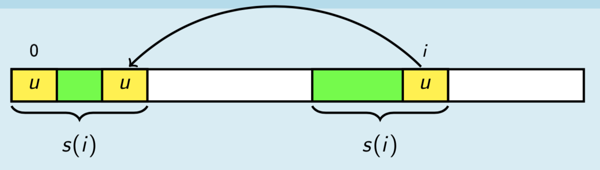
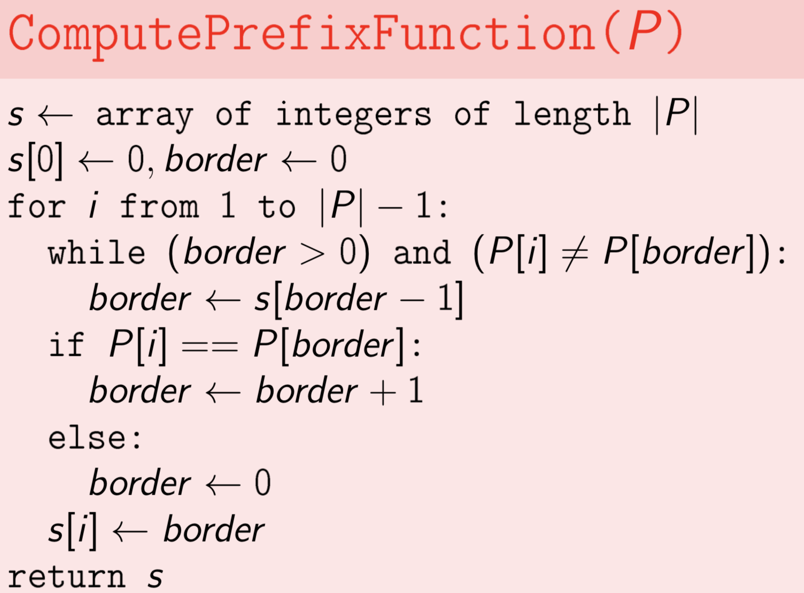
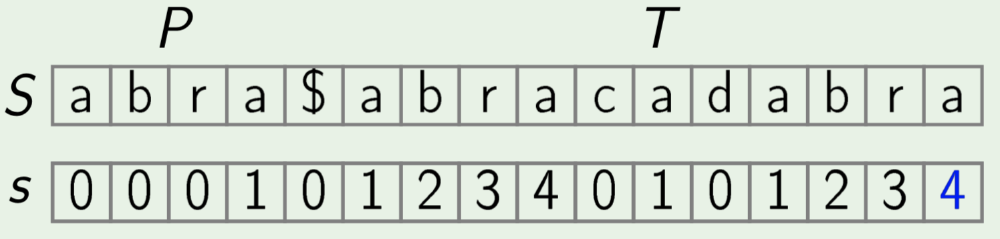
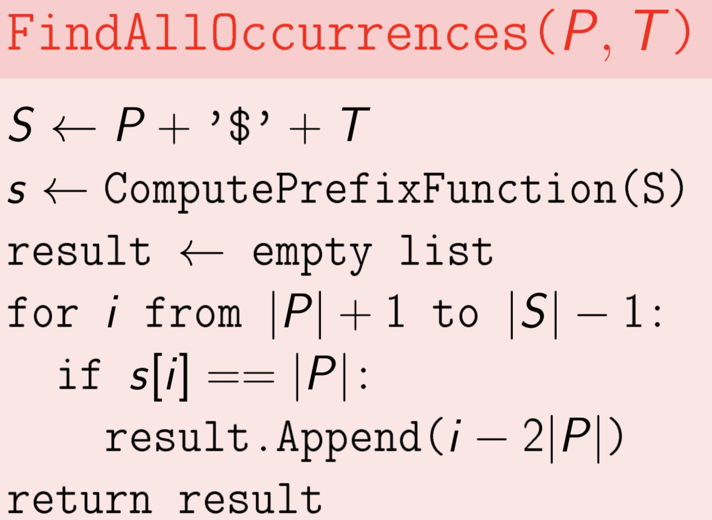

Exact Pattern Matching
**Input**: Strings T (Text) and P (Pattern).
**Output**: All such positions in T (Text) where P (Pattern) appears as a
substring.
(the position is 0-based index)

Defintion:
**Border** of string S is a prefi􏰓x of S which is equal to a suffi􏰔x of S, but **not equal to** the whole S.
Example:
**􏰐a**􏰑 is a border of 􏰐**a**rb**a**􏰑
**􏰐ab**􏰑 is a border of **􏰐ab**cd**ab􏰑􏰐**
**abab􏰑** is a border of 􏰐**ababab**􏰑 􏰐
**ab**􏰑 is not a border of 􏰐**ab**􏰑

For shifting border pattern

Find longest common prefix -> u

Find **w** -  the longest border of **u**

Move ***P*** such that prefix ***w*** in ***P*** aligns with suffix ***w*** of ***u*** in ***T***.
In this way, we can skip some of the comaprisons
But we shouldn't miss any of the pattern occurrences in the text.

Prefix function
Definition:
**Prefi􏰓x** function of a string P is a function s(i) that for each i returns the length of the longest border of the pre􏰓x P[0..i].
Example:

For, the prefix funciton, there is a property
$s(i)$ has a border of length $max(s(i+1)-1, 0)$
**Proof**

-   Take the longest border ***w*** of P[0..i+1]
-   Cut the last character from ***w*** -- it's a border of P[0..i] now

we can conclude that $s(i+1)<s(i)+1$

if $s(i)>0$, then all borders of P[0..i] but for the longest one are also borders of P[0..$s(i)-1$]. 
Proof

-   Let $u$ be a border of P[0..i] such that $|u| < s(i)$
-   Then $u$ is both a pre􏰓fix and a suffi􏰔x of P[0..s(i) − 1]
-   u != P[0..s(i) − 1], so u is a border of P[0..s(i) − 1]

For enumerating borders
All borders of P[0..i] can be enumerated by taking the longest border $b_1$ of P[0..i], then the longest border $b_2$ of $b_1$, then the longest border $b_3$ of $b_2$, ..., and so on.

## KMP

