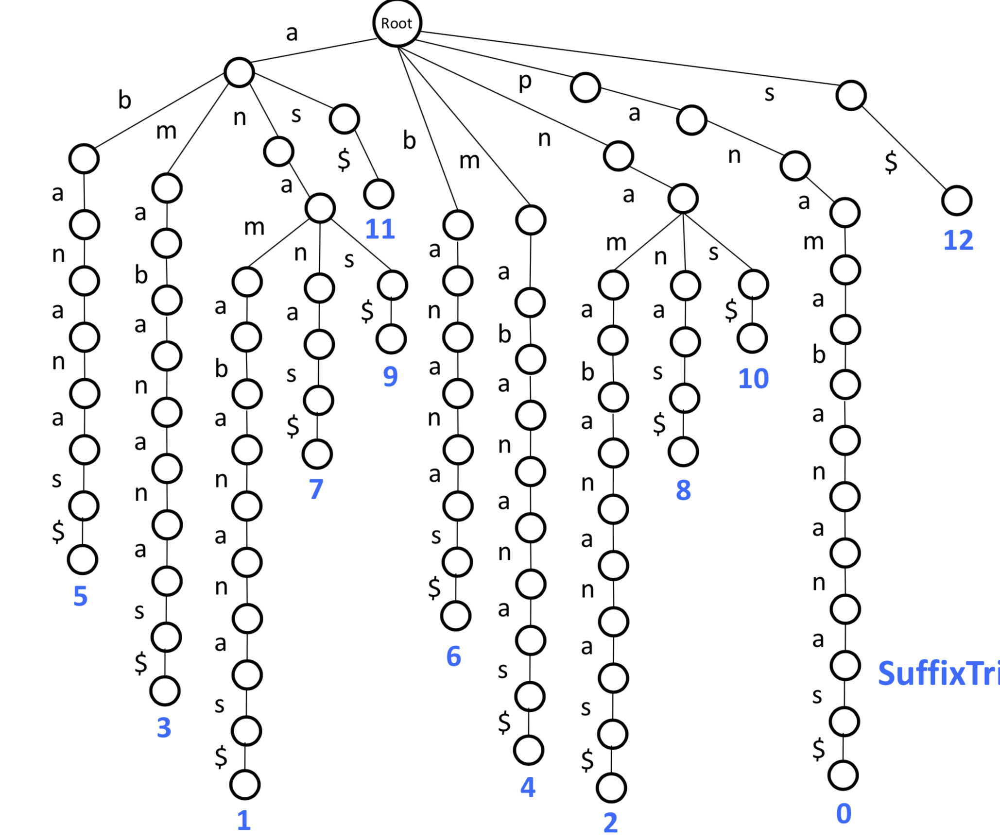

### Pattern Matching
**Input**: A string Pattern and a string Text.
**Output**: All positions in Text where pattern appears as a substring

**Approximate** Pattern Matching Problem:
**Input**: A string Pattern, a string Text, and an integer d
**Output**: All positions in Text where Pattern appears as a substring **with a most d mis matches**.

**Multiple** Pattern Matching Problem:
**Input**: A set of strings Patterns and a string Text.
**Output**: All positions in Text where a string from Patterns appears as a substring.

First, we can use a brute force approach to exact pattern matching.
For single pattern matching, the time complexity is $O(|Text|*|Pattern|)$
However, the runtime of the Knuth-Morris-Pratt algorithm: O(|Text|)

And even worse, Brute Force Approach is Slow for Billions of Patterns.

We can make some improvement, such as Herding Patterns into (Prefix Tree).

```Python
def TrieMatching(Text, Patterns):
    drive Prefix tree along Text at each position of Text
    walk down Trie(Patterns) by spelling symbols of Text
    a pattern from Patterns matches Text each time you reach a leaf!
```

By this improvement, the runtime of Prefix Tree Matching is $O(|Text|*|LongestPattern|)$
The Prefix Trie construction takes $O(|Patterns|)$ time, and it's space complexity is about $O(|Patterns|)$.

### Suffix Tree
Generate all suffixes of Text. Form a trie out of these suffixes (suffix trie). For each Pattern, check if it can be spelled out from the root downward in the suffix trie. 
If we want to find the positions of matches, add some information to **leaves**.

Once we find a match, we “walk down” to the leaf (or leaves) **in order to** find the starting position of the match.

The suffix tree space complexity is $|Text|*(|Text|-1)/2$ which $|Text|$ is the length of whole text.

We can short the leaves that take to form the suffix tree

the vertices on the suffix tree will dramatically decreases.
We can also then store the slice information of each edge!


If we want to find mutations, it is unclear how to develop fast **Approximate** multiple Pattern Matching using suffix trees.