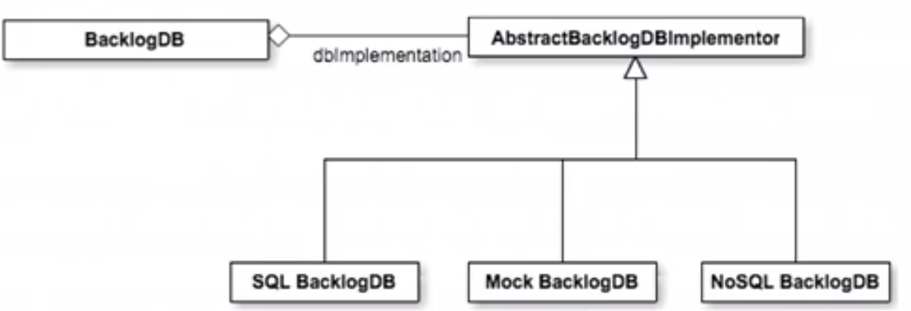
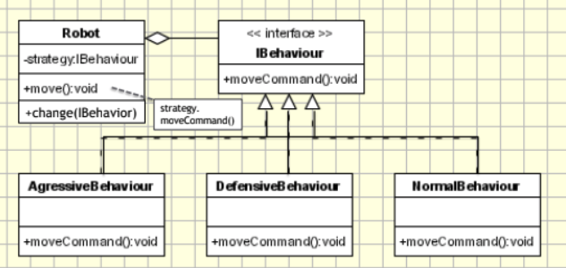

Principles that govern design patterns (SOLID Principles)
**Single responsibility** objects should provide coherent functionality, captured by a single reason to change them
**Open-close principle** object designs should be open to extension, but closed to modification
**Liskov's substitution** one class can only be treated as a subtype of another if it can be substituted for the superclass in every context
**Interface segregation** objects should not be forced to implement operations useless to them
**Dependency inversion** complex high-level classes should not directly depend on low-level classes that are likely to change

**Dependence injection** rather than objects creating and managing their own dependencies, clients install them into objects and manage them

## Bridge
allowing for alternative implementations of abstraction
**Use when**: expecting implementation of a class to change because of the anticipation of new reason
**Intent**: decouple interfaces of a class from its **implements** so that the **interfaces** and **implements** can vary independently

we can easily change the implementation of the abstraction, for different database and even implement through a **mock** database

## Observer
**Use when** the change of a state in one object must be reflected in another object without keeping the objects tightly coupled
**Intent** maintain the consistency across the states of a publisher and his subscribers(low coupling)

## Composite
**Use when** deal with objects uniformly regardless of position in an object hierarchy
**Intent** compose objects into tree structures to represent part-whole hierarchies 
it is a recursive object hierarchy that propagates behavior down to components

## Facade
encapsulating subsystems
**Use when** it's desirable to **isolate** a complex subsystem through a **simple** interface
**Intent** reduce coupling among a set of related classes and the rest of the system

## Strategy
**Use when** it's desirable to make an object adaptable by allowing clients to change its behavior dynamically
**Intent** define a family of algrithms, encapsulate each one, and make them interchangeable

The diagram is pretty similar to bridge
except client can change the behavior of the Robot! i.e. the behavior of the **objects**.

## Factory
creating objects without knowing about their implementation
**Use when** a superclass to handle all standard behavior related to the processing of a set of products, but defer the creation of the products to concrete subclasses
**Intent** define an interface for creating objects, but let subclasses decide which class to instantiate at runtime

## Adapter
adapter converts the **interface** of a legacy class into a different interface expected by the clients so that the clients are not affected after the legacy class has been replaced